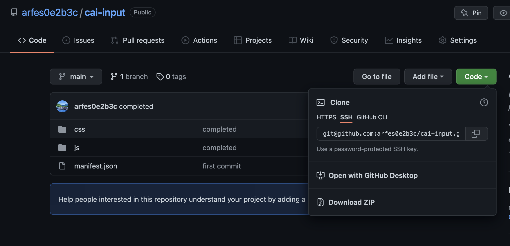
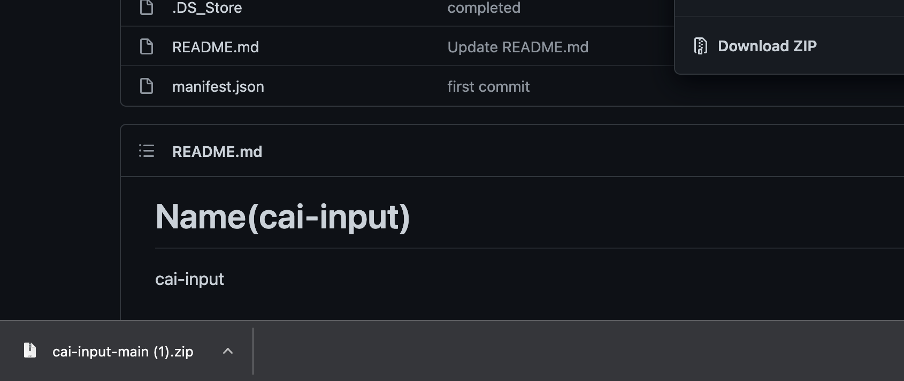
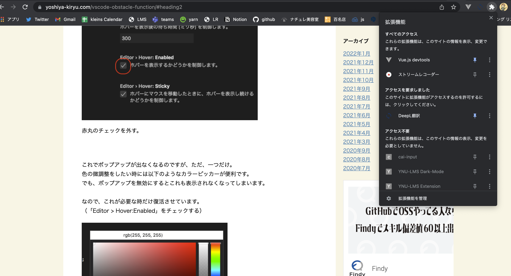
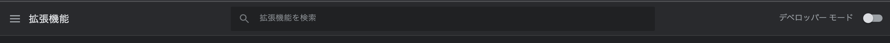
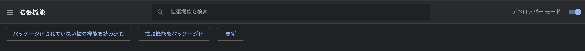
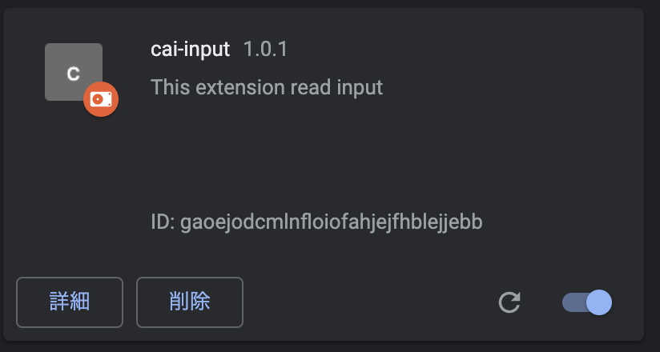
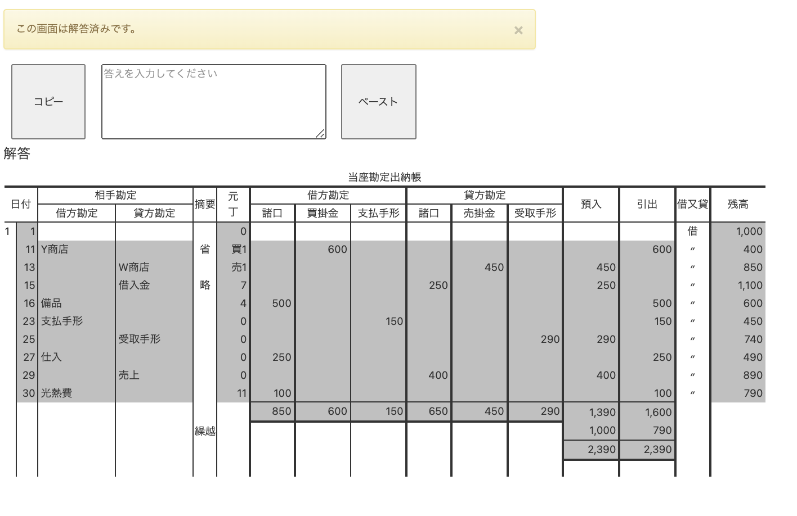

# この拡張機能のダウンロード方法、使い方
ステップ１：Codeという緑のボタンを押し、Download Zipボタンを押します。(ダウンロードが始まります。)

ステップ２：ダウンロードが終了したら、左下のファイルを押してフォルダを開き、ダウンロードしたフォルダの場所を確認しておいてください。
自分がわかりやすい場所に置いておくと便利だと思います(デスクトップがおすすめです。)

ステップ３：場所が確認できたら、chromeの右上にあるジグソーパズルの様なボタンを押し、「拡張機能を管理」というボタンを押します。

ステップ４：ページが移動したら、右上のデベロッパーモードをONにしてください(青くなればOKです)。

ステップ５：デベロッパーモードがONになると出現する「パッケージ化されていない拡張機能を読み込む」を押します。

ステップ６：フォルダを選択する画面が出てくるので、ステップ２で確認した(もしくは移動した)場所の、ダウンロードしたフォルダを選択します。
下の様に拡張機能が追加されていれば成功です。

ステップ７：CAIに移動し、以下の様に表示されていることを確認してください

ステップ８：CAIを終わらせており、自分と同じ問題を回答した優等生を見つけます

ステップ９：そいつにもこの拡張機能をインストールさせます

ステップ10：そいつの解答画面でコピーボタンを押し、LINEやDiscordなどでコピーした文字を送ってもらいます

ステップ11：送られてきた文字を自分のCAIの回答画面の入力欄にペーストします

ステップ12：ペーストボタンをクリックすると回答を自動で入力することができます
